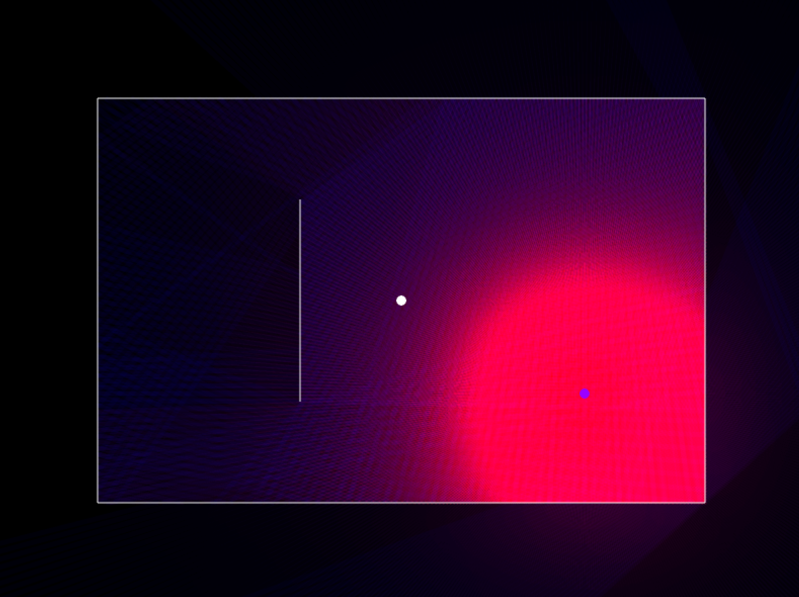

# Visual Audio Ray Tracer

## Project Overview

This project is a visual audio ray tracer built using GoLang, Ebiten, and Oto. It was developed as an end-of-studies project to explore the intersection of audio and visual rendering through ray tracing techniques.

## Features

- Real-time audio visualization using ray tracing.
- Interactive user interface built with Ebiten.
- Audio processing and playback handled by Oto.
- Customizable visual effects and audio inputs.

## Demo

Check out my video of this project on YouTube:
[YouTube Demo Video coming soon]()
